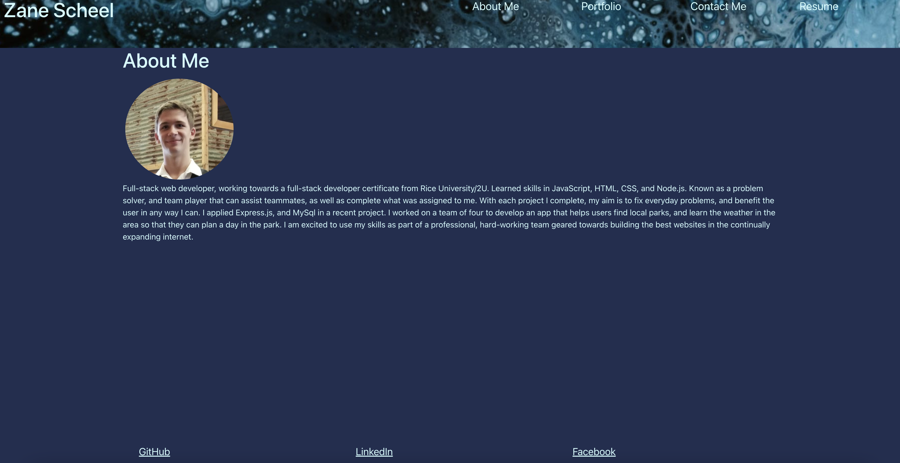

### my-portfolio-reactified

## Description
This is my portfolio created with react, It displays 5 of my projects, an about me, my resume, and a contact form. When you click on the links at the top, it will re-render the page depending on the section you clicked. The header and footer stay the same no matter what page you are on. there are links to my GitHub, LinkedIn, and Facebook in the footer. On all of the projects you can follow a link to the project page and the repository. Finally, you can find a link to my resume in the resume section.

## Installation

To install this, you can either clone the repository, run npm i, then run npm start and go to your local host. You can also just visit the deployed
[Website](https://derpvoltz.github.io/my-portfolio-reactified/)

## Screenshot

